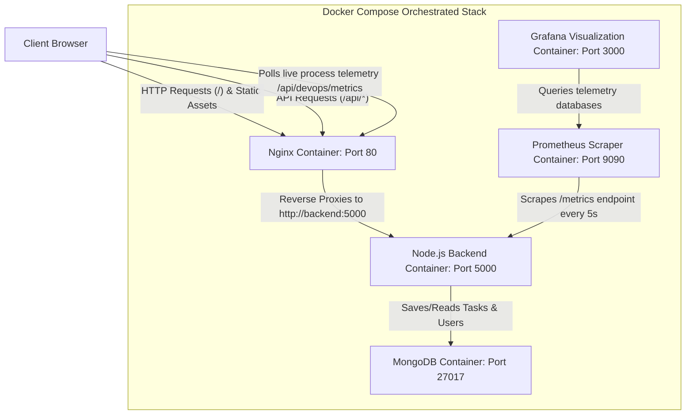

# System Architecture Documentation

This document explains the architecture, request routing, telemetry monitoring flow, and automation pipelines for the **Multi-Environment Deployment System**.

---

## 🏛️ System Architecture Diagram



---

## 🔌 Core Components & Request Flow

### 1. Reverse Proxy & Request Flow
* When a user visits the application, their browser contacts the **Nginx reverse proxy** (on Port 80).
* **Static Assets:** Nginx serves the pre-built React frontend assets (HTML, CSS, JS) directly from `/usr/share/nginx/html`.
* **API Requests:** When the React client requests endpoints matching `/api/*`, Nginx intercepts the call and forwards it to the backend container at `http://backend:5000/api/*` using the internal Docker DNS network.
* **Benefits:** 
  * Avoids Cross-Origin Resource Sharing (CORS) complications since both assets and backend calls are served under the same origin (Port 80).
  * Prevents external clients from directly accessing the backend service port, enhancing network security.

### 2. Database Connectivity & Data Flow
* The backend communicates with MongoDB using standard Mongoose ORM drivers.
* Inside Docker Compose, the database URI is resolved using the service hostname `mongodb:27017` inside the shared network.
* **Service Isolation:** MongoDB's port `27017` is mapped only internally, ensuring that external threats cannot connect to the database directly.

---

## 📊 Telemetry & Monitoring Architecture

The project features a **two-tier telemetry system**: a real-time live dashboard and a historic metric aggregator.

### 1. Real-Time UI Telemetry
* The frontend React application features a live **DevOps Metrics** dashboard.
* Every 5 seconds, the UI makes a secure, authenticated request to `/api/devops/metrics`.
* Rather than querying Prometheus (which would introduce slow, coupled network requests), the Express backend queries its own local memory registers using `prom-client` and standard Node APIs:
  * **CPU usage** is computed using `process.cpuUsage()` and delta hrtime values, reporting process CPU load.
  * **Memory usage** retrieves the resident set size (RSS) from `process.memoryUsage()`.
  * **API request rates** are summed directly from the local `prom-client` HTTP request counter registry.

### 2. Historic Metrics Stack (Prometheus & Grafana)
* **Metric Registration:** On the backend, `prom-client` hooks Express middleware to intercept all requests, keeping track of route paths, request methods, and status codes.
* **Scraping:** Prometheus runs as an independent daemon. Every 5 seconds, it initiates a scrape query against the backend’s `/metrics` endpoint to log CPU, memory, and HTTP traffic.
* **Visualization:** Grafana is configured with Prometheus as its default datasource (`http://prometheus:9090`). It uses a JSON configuration to provision panels displaying graphs for requests per route, CPU seconds, and total memory over time.

---

## 🤖 CI/CD Pipeline Automation

GitHub Actions orchestrates validation and deployment verification using independent jobs:

```
[GitHub Actions Runner]
   │
   ├──> 1. Run ESLint (Verify frontend syntax & quality)
   │
   ├──> 2. Run Jest Backend Tests (Verify Express logic via in-memory MongoDB)
   │
   └──> 3. Build & Verify Stack:
          ├── Build Docker images
          ├── docker compose up -d --build (Launch full network)
          ├── Poll /health check endpoint to confirm backend starts successfully
          └── docker compose down (Clean up resources)
```
* **Strict Gatekeeping:** Each stage must complete successfully (exit code 0) for the pipeline to pass, preventing buggy code from reaching production.
